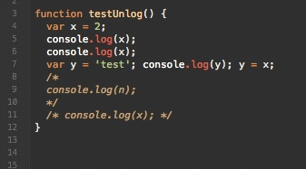

# unlog.chocmixin

A mixin for [Chocolat](http://www.chocolatapp.com) to remove console.logs from JS and Coffeescript.

This Mixin adds to menu items: `Actions/Javascript/Remove console.log(s)` and `Actions/Coffeescript/Remove console.log(s)`.

If you have a selection, only console.log statements in the selection will be removed, otherwise they'll be removed from the whole document.
